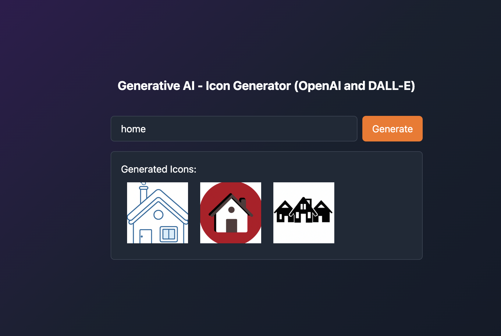

# AI Icon Generator

 

## Table of Contents

- [Introduction](#introduction)
- [Features](#features)
- [Installation](#installation)
- [Usage](#usage)
- [License](#license)
- [Contact](#contact)

## Introduction

The AI Icon Generator is a web application that utilizes the OpenAI API to generate images based on textual prompts. It leverages the power of the DALL·E model to create images from simple keywords.

## Features

- Enter a prompt and generate 3 set of images based on the provided text.
- View/Download the generated image in the application.

## Installation

1. Clone the repository:
   `git clone https://github.com/your-username/dalle-image-generator.git`

2. Navigate to the project directory:
   `cd ai-icon-generator`

3. Install the dependencies:
   `npm install`
4. Set up your OpenAI API key by creating a `.env` file in the root directory and adding the following line:
   `VITE_Open_AI_Key=your-openai-api-key`
5. `npm run`

## Usage

1. Enter a prompt in the text area provided.
2. Click the "Generate" button to generate an image based on the prompt.

## License

This project is licensed under the [MIT License](LICENSE).

## Contact

For any inquiries or support, please contact me at [thefmcoder@gmail.com](mailto:thefmcoder@gmail.com).
